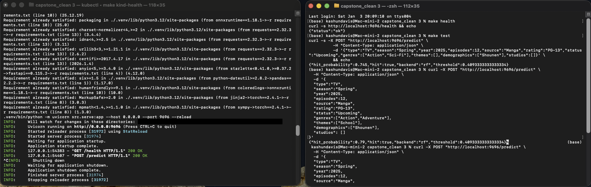

# Anime Hit Prediction (ML Zoomcamp Capstone)


Predict whether an anime will be a **“hit”** (e.g., top 20% by popularity) using **pre-release / announcement metadata** only (cold-start prediction).  

- Baseline ML models (scikit-learn)
- A small **tabular deep learning** model (PyTorch)
- Export to **ONNX** for lightweight inference
- Deployments:
  - **FastAPI** web service
  - **Docker** container
  - **Serverless deep learning** (AWS Lambda container)
  - **Kubernetes** (kind/minikube)

> Beginner path: **Local Python → Train → Serve → Test**. Then add **Docker → Lambda → Kubernetes**.

---

## Results

Metrics on the held-out test split (seed = 42). Threshold chosen on validation set to maximize F1.

| Model | ROC-AUC | PR-AUC | F1 | Threshold | Notes |
|------|---------:|-------:|---:|----------:|:------|
| Baseline (rf) | 0.966565 | 0.888908 | 0.797891 | 0.435 | One-hot + numeric + multi-hot features |
| Deep Model (HitNet) | 0.901108 | 0.731609 | 0.544103 | 0.369569 | Torch tabular model (multihot + embeddings/multihot) |

**Deployment default:** the API ships with **Random Forest** as the default backend (`MODEL_BACKEND=rf`).
HitNet remains available as an **optional** backend (`MODEL_BACKEND=hitnet`).

## Model selection rationale

Random Forest is the default deployment model because it outperformed the deep tabular network on this dataset across ROC-AUC, PR-AUC, and F1 on the held-out test split. Tree-based models also tend to be strong and reliable on structured/tabular data with mixed feature types, making RF a practical choice for a stable “production” baseline. The deep learning (HitNet) workflow is kept as an optional extension to demonstrate an end-to-end DL training + ONNX deployment path and to support future experimentation.


---

## Table of contents

- [Problem](#problem)
- [Dataset](#dataset)
- [Leakage rules](#leakage-rules)
- [Project structure](#project-structure)
- [Prerequisites](#prerequisites)
- [Install prerequisites by OS](#install-prerequisites-by-os)
- [Clone the repo](#clone-the-repo)
- [Set up Python environment](#set-up-python-environment)
- [Train a model](#train-a-model)
- [Run a single prediction](#run-a-single-prediction)
- [Serve with FastAPI](#serve-with-fastapi)
- [Test the API](#test-the-api)
- [Docker deployment](#docker-deployment)
- [Serverless deployment (AWS Lambda container)](#serverless-deployment-aws-lambda-container)
- [Kubernetes deployment (kind/minikube)](#kubernetes-deployment-kindminikube)
- [Troubleshooting](#troubleshooting)
- [Next steps](#next-steps)
- [Acknowledgements](#acknowledgements)

---

## Problem

**Goal:** Given an anime’s metadata (type/season/year/episodes/genres/etc.), predict whether it will be a **hit**.

**The Why:** I like anime which is why i chose this project. Also this something that studios can use to determine if a particular anime or manga will be a hit or not from a business perspective. If I made this an app users could see if the upcoming series is likely to be something they would watch or read.

**Target definition (example):**  
`is_hit = 1` if `members` is in the top **20%** of the dataset (threshold computed from training data).

**Metrics:** ROC-AUC (primary), PR-AUC and F1 (secondary).

---

## Dataset

This project uses two CSV files:

- `details.csv` — metadata (titles, genres, studios, source, rating, episodes, year, etc.)
- `stats.csv` — engagement statistics (watching, completed, plan_to_watch, vote breakdowns, etc.)

### Where should the CSV files live?
Different project starters use different folder layouts:

- If you have a **`data/` folder**, place them here:
  - `data/details.csv`
  - `data/stats.csv`
- If your files are in the **repo root**, that’s okay too:
  - `./details.csv`
  - `./stats.csv`

> If a script expects `data/details.csv` but your files are in the repo root, either move them into `data/` or pass the correct path if the script supports CLI args.

---

## Leakage rules

Because this is a **cold-start** problem, the following fields are **not allowed as features** (they depend on user engagement / post-release information):

- `members`, `favorites`, `scored_by`, `score`
- `rank`, `popularity`
- any columns from `stats.csv` (watching/completed/dropped/plan_to_watch/…)

✅ You *may* use `members` to **create labels** during training (e.g., “top 10%”), but do **not** feed it into the model at inference time.

---

## Project structure

Your repo may look like one of these two common layouts.

### Layout A — “Similar to the Midterm” (root scripts)
```bash
.
├── Dockerfile
├── README.md
├── requirements.txt
├── config.json
├── train.py
├── predict.py
├── serve.py
├── utils.py
├── details.csv
└── stats.csv
```

### Layout B — “Final Capstone Repo” (src/ + artifacts + k8s)
```bash
.
├── Dockerfile
├── README.md
├── requirements.txt
├── requirements-lambda.txt
├── data/
│   ├── details.csv
│   └── stats.csv
├── notebooks/
│   └── capstone_end_to_end.ipynb
├── artifacts/
│   ├── rf_pipeline.joblib
│   ├── rf_meta.json
│   ├── rf_threshold.json
│   ├── rf_metrics.json
│   ├── hitnet.pt              # optional
│   ├── hitnet.onnx            # optional
│   └── preproc.json           # optional
├── docker/
│   └── Dockerfile.lambda
├── k8s/
│   └── deployment.yaml
└── src/
    ├── preprocess.py
    ├── model_torch.py
    ├── train_torch.py
    ├── train_rf.py
    ├── predictor.py
    ├── export_onnx.py
    ├── inference_onnx.py
    ├── serve.py
    └── lambda_function.py
```

---

## Prerequisites

### Required (for local Python run)
- **Python 3.10+** (3.11 recommended)
- **Git**
- A terminal:
  - macOS: Terminal / iTerm2
  - Windows: PowerShell / Windows Terminal (WSL2 optional but recommended)
  - Linux: any terminal

### Optional (only for Docker / Serverless / Kubernetes)
- **Docker Desktop** (Mac/Windows) or Docker Engine (Linux)
- **kubectl** (Kubernetes CLI)
- **kind** (Kubernetes in Docker) or **minikube**
- **AWS CLI** (only if deploying to AWS)

---

## Install prerequisites by OS

> This section tells you *what* to install. If you prefer, you can install from official downloads instead of package managers.

### macOS (Intel or Apple Silicon)
- Install **Homebrew** (search: “Homebrew install”)
- Then:
```bash
brew install git python@3.11
```
Optional:
```bash
brew install kubectl kind
```

Docker:
- Install Docker Desktop (search: “Docker Desktop for Mac”).

### Windows 10/11
Recommended beginner setup:
1. Install **Python 3.11** (python.org)
2. Install **Git for Windows**
3. Install **Docker Desktop**
4. (Optional but helpful) Enable **WSL2** for smoother Linux-like workflows

> If you use WSL2, run the Linux commands inside Ubuntu (WSL terminal).

### Linux (Ubuntu/Debian example)
```bash
sudo apt-get update
sudo apt-get install -y git python3 python3-venv python3-pip
```

Optional:
- Install Docker Engine + Compose (search: “Install Docker Engine Ubuntu”)
- Install kubectl/kind (search: “install kubectl linux”, “install kind linux”)
---

### Link to Download Data (If Data is not already in Repo)
Open a Terminal to download full dataset, extract zip file, and then place the details.csv and stat.csv in the `/data` folder within the repo. The data is currently in the repo but if it is not for some reason here you go.
```bash
curl -L -o ~/Downloads/anime-dataset-jan-1917-to-oct-2025.zip\
  https://www.kaggle.com/api/v1/datasets/download/neelagiriaditya/anime-dataset-jan-1917-to-oct-2025
```

---

## Clone the repo

### Option A — Clone with Git (recommended)
Open a terminal and run:

```bash
git clone <YOUR_REPO_URL_HERE>
cd <YOUR_REPO_FOLDER_NAME_HERE>
```

**Where to run commands:**  
Run commands **inside the project folder** (the one that contains `train.py` OR `src/`).

### Option B — Download ZIP
1) Download ZIP from GitHub  
2) Unzip  
3) Open a terminal **inside that unzipped folder**  
4) Continue below

---

## Set up Python environment

### macOS / Linux
```bash
python3 -m venv .venv
source .venv/bin/activate
python -m pip install --upgrade pip
pip install -r requirements.txt
```

### Windows (PowerShell)
```powershell
python -m venv .venv
.\.venv\Scripts\Activate.ps1
python -m pip install --upgrade pip
pip install -r requirements.txt
```

✅ If your prompt shows `(.venv)` you’re good.

---

## Train a model

### If you have `train.py` (Layout A)
Train a baseline model using config defaults:

```bash
python train.py --target hit --topk 0.10 # changing the hit rate to 10%; default is 20%
```

This should:
- merge `details.csv` + `stats.csv`
- create the `is_hit` label
- train a model
- save artifacts (e.g., to `artifacts/`)

### If you have `src/` (Layout B)

Train the **default Random Forest** model:

```bash
python -m src.train_rf --details data/details.csv --artifacts artifacts
```

Artifacts produced:
- `artifacts/rf_pipeline.joblib`
- `artifacts/rf_meta.json`
- `artifacts/rf_metrics.json`
- `artifacts/rf_threshold.json`

Optional deep learning workflow (bonus):

```bash
python -m src.train_torch --details data/details.csv --epochs 15
python -m src.export_onnx --artifacts artifacts
```

Optional artifacts produced:
- `artifacts/hitnet.pt`
- `artifacts/preproc.json`
- `artifacts/hitnet.onnx`

> Apple Silicon tip: training should use **MPS** automatically if available.

---

## Run a single prediction

### If you have `predict.py` (Layout A)
```bash
python predict.py --target hit   --title "Example"   --genres "Action,Sci-Fi"   --year 2025   --episodes 12   --type TV   --season Spring   --source Manga   --rating PG-13   --status Upcoming
```

### If you have `predict_sample.py` (Layout B)
```bash
python predict_sample.py
```

---

## Serve with FastAPI

### 13.1 Test locally (beginner-friendly)

**You’ll use two terminals:**

- **Terminal A** = runs the server (leave it running)
- **Terminal B** = sends requests (curl)

#### Terminal A — open a terminal in the project folder, set up env, install deps

```bash
# 1) Go to the repo root (the folder that contains: Dockerfile, requirements.txt, src/, artifacts/, data/)
cd /path/to/your/project

# 2) Create + activate a virtual environment
python3 -m venv .venv
source .venv/bin/activate   # macOS/Linux
# Windows (PowerShell): .\.venv\Scripts\Activate.ps1

# 3) Upgrade pip and install requirements
python -m pip install --upgrade pip
pip install -r requirements.txt
```

#### Terminal A — start the local API server

> This project’s API module is **`src/serve.py`**, so you start it with **`src.serve:app`** (not `serve:app`).

```bash
uvicorn src.serve:app --host 0.0.0.0 --port 9696 --reload
```

If you see: **“Could not import module …”**, check:

- You are running the command **from the repo root**
- The file exists at `src/serve.py`
- `src/__init__.py` exists (so `src` is a package)

#### Terminal B — run a test request of the API (open a NEW terminal window)

```bash
curl -X POST http://localhost:9696/predict \
  -H "Content-Type: application/json" \
  -d '{"type":"TV","season":"Spring","year":2025,"episodes":12,"source":"Manga","rating":"PG-13","status":"Upcoming",
       "genres":["Action","Adventure"],"themes":["School"],"demographics":["Shounen"]}'
```

Expected response shape (example):
```json
{"hit_probability": 0.73, "hit": true}
```

## Serve with FastAPI: Makefile shortcut (recommended)

From the repo root open a new terminal (Terminal A):

```bash
make install                            # create venv + install deps
make train                              # train RF (default) -> artifacts/
make serve                              # start FastAPI (default: http://localhost:9696)

# Optional deep learning workflow
make train-dl                           # train HitNet (PyTorch) -> artifacts/
make export-dl                          # export HitNet to ONNX -> artifacts/
make serve-env MODEL_BACKEND=hitnet     # start FastAPI (default: http://localhost:9696)
```

In a new terminal (Terminal B):

```bash
make health
make test
```

Tip: You can override ports/thresholds:

```bash
make serve PORT=9696
make test PORT=9696
make serve-env THRESHOLD=0.60
```

Screenshot of FastAPI Service for Local Deployment


---

## Docker deployment

### Install Docker
Install Docker Desktop (Mac/Windows) or Docker Engine (Linux), then confirm:

```bash
docker --version
```

### Build + run (most repos)
From the project folder open a new terminal (Terminal A):

```bash
docker build -t anime-hit-api:latest .
docker run --rm -p 9696:9696 anime-hit-api:latest
```

> Note: the Docker image expects model files under `artifacts/`.
> Run `make train` (RF) first so `artifacts/` contains `rf_pipeline.joblib`, etc.

Or Use the Makefile shortcut
```bash
make docker-build
make docker-run
```

### Apple Silicon (M1/M2/M3/M4) compatibility tip
If you’re building for a Linux amd64 environment (common for Lambda/cloud):

```bash
docker buildx build --platform linux/amd64 -t anime-hit-api .
```

Open a new terminal (Terminal B): 
### Test 1

```bash
curl -X POST "http://localhost:9696/predict" \
  -H "Content-Type: application/json" \
  -d '{
  "type":"TV",
  "season":"Spring",
  "year":2025,
  "episodes":12,
  "source":"Manga",
  "rating":"PG-13",
  "status":"Upcoming",
  "genres":["Action","Adventure"],
  "themes":["School"],
  "demographics":["Shounen"],
  "studios": []
}'
```

### Test 2

```bash
curl -X POST "http://localhost:9696/predict" \
  -H "Content-Type: application/json" \
  -d '{
  "type":"TV",
  "season":"Spring",
  "year":2025,
  "episodes":12,
  "source":"Manga",
  "rating":"PG-13",
  "status":"Upcoming",
  "genres":["Action","Sci-Fi"],
  "themes":["School"],
  "demographics":[],
  "studios": []
}'
```

Switching backends:
- Default: RF (`MODEL_BACKEND=rf`)
- Optional: HitNet (`MODEL_BACKEND=hitnet`) i.e. `make docker-run MODEL_BACKEND=hitnet`
---

## Serverless deployment (AWS Lambda container)

Only do this section if your repo includes a Lambda Dockerfile at `docker/Dockerfile.lambda`.

### Build + run locally (Lambda Runtime Interface Emulator)
```bash
docker buildx build --platform linux/amd64 -f docker/Dockerfile.lambda -t anime-hit-lambda .
docker run --rm -p 9000:8080 anime-hit-lambda
```
> Alternative: Using Makefile shortcut
```bash
make docker-build-lambda
make docker-run-lambda
```

Invoke:
```bash
curl -X POST "http://localhost:9000/2015-03-31/functions/function/invocations" \
  -H "Content-Type: application/json" \
  -d '{
    "type": "TV",
    "season": "Spring",
    "year": 2025,
    "episodes": 12,
    "source": "Manga",
    "rating": "PG-13",
    "status": "Upcoming",
    "genres": ["Action"],
    "themes": ["School"],
    "demographics": ["Shounen"]
  }'
```

Switching backends:
- Default: RF (`MODEL_BACKEND=rf`)
- Optional: HitNet (`MODEL_BACKEND=hitnet`) i.e. `make docker-run-lambda MODEL_BACKEND=hitnet`

Cloud steps (high level):
- Create ECR repo → push image → create Lambda from container image
- Expose via Function URL or API Gateway

---

## Kubernetes deployment (kind/minikube)

Only do this section if your repo includes `k8s/` manifests.

### Tools check
```bash
kubectl version --client
kind version
```

### kind: create cluster
```bash
kind create cluster
```

### Build + load image into kind
```bash
docker build -t anime-hit-api:latest .
kind load docker-image anime-hit-api:latest
```

### Deploy manifests
```bash
kubectl apply -f k8s/deployment.yaml

kubectl get pods
kubectl get svc
```

### Test (option A: NodePort)
If your service is NodePort and mapped (example):
```bash
curl http://localhost:30080/health
```

### Test (option B: port-forward)
```bash
kubectl port-forward svc/anime-hit-api-svc 9696:9696
```
Then reuse the same `/predict` curl from above.

## Kubernets Deployment: Makefile shortcut (recommended)

From the repo root:

```bash
make kind-tools-check       # tools check
make kind-create            # create cluster
make kind-load              # build and load image into kind
make kind-apply             # deploy manifests
make kind-health            # port forward health test
```

In a new terminal:

```bash
make kind-test # runs the `/predict` curl from above
```

Expected response shape (example):
```json
{"hit_probability": 0.73, "hit": true}
```

---

---

## Recommended .gitignore

`.gitignore` refers to the following:

- `.venv/`
- `__pycache__/`
- `*.pyc`
- `.DS_Store`

---

## Troubleshooting

### “command not found: python”
- macOS/Linux: try `python3`
- Windows: ensure Python is installed and on PATH

### “ModuleNotFoundError”
- Your venv isn’t activated; activate it and reinstall:
```bash
pip install -r requirements.txt
```

### “File not found” for CSVs
- You’re not in the project folder OR your CSVs are in a different path.
- Move CSVs into `data/` or update the path argument.

### Port already in use (9696)
- Stop the old process, or run the server on another port if supported.

### Docker build issues on Apple Silicon
- Use `docker buildx build --platform linux/amd64 ...` when targeting amd64 environments.

---

## Next steps

To make this README “capstone-complete”, add:

1) **Results table** (metrics for each model: baseline ML vs DL)
2) A short **model card**:
   - training data snapshot
   - leakage policy
   - known limitations
3) A screenshot/GIF of calling `/predict`
4) (Bonus) Cloud deploy section (e.g., AWS ECR + Lambda URL or a simple VM)

---

## Acknowledgements

This repository is a project carried out as part of **Machine Learning Zoomcamp** by DataTalks.Club.
Dataset: MyAnimeList/Kaggle-style exports (add the exact source link in your final submission).
